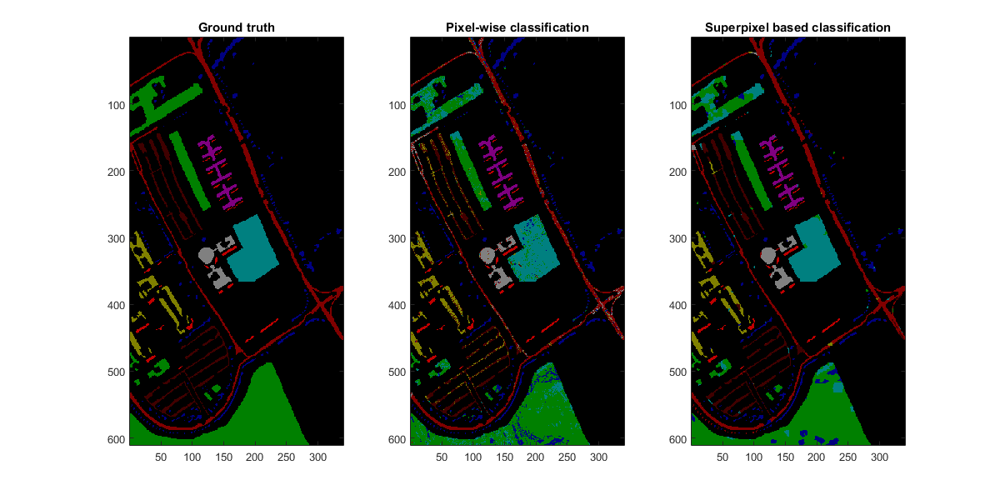

# HSIClassification

Hyperspectral image classification with varies image processing and machine learning methods, including dimensional reduction, over-segmentation,and classifiers(Multinomial Logist Resgression, Sparse Representation based Clasifiers)...
The purpose of this repository is for my own education of machine learning methods.

## feature extraction
GLCM, Gabor, Morphological Profile(MP), Attributr Profile (AP)

## dimensional reduction
PCA, KernelPCA, LDA

## classifiers
SVM(based on LibSVM), random forest(based on open soruce toolbox), (joint)sparse respresentation based classifiers (based on SPAMS), and L1/L2 regularized multinomial logistic regression

