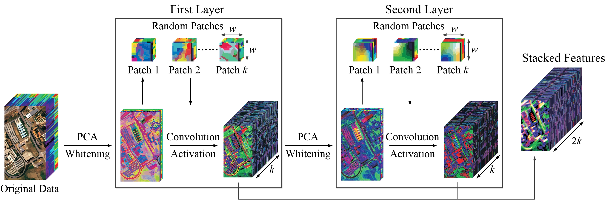

# Hyperspectral Image Classification via a Random Patches Network

Matlab implementation of our method for hyperspectral image classification.



## Paper
[Hyperspectral Image Classification via a Random Patches Network](https://www.sciencedirect.com/science/article/pii/S0924271618301473)

Please cite our paper if you find it useful for your research.

```
@article{rpnet,
  title={Hyperspectral image classification via a random patches network},
  author={Xu, Yonghao and Du, Bo and Zhang, Fan and Zhang, Liangpei},
  journal={ISPRS Journal of Photogrammetry and Remote Sensing},
  volume={142},
  pages={344--357},
  year={2018}
}

```

## Installation
* Clone this repo.
```
git clone https://github.com/YonghaoXu/RPNet
```

## Dataset
* We have uploaded the Indian Pines image and the corresponding annotations into the `dataset` folder.

## Usage
* Add the directory path for the dependencies files in `RPNet.m`.
```
addpath(genpath('/utils/'))
addpath(genpath('/dataset/'))
```
You may change these two commands according to your environment.
* Run `RPNet.m`.

## Acknowledgement
* The [LibSVM](https://github.com/cjlin1/libsvm) package from [Prof. Chih-Jen Lin](https://www.csie.ntu.edu.tw/~cjlin/index.html) is utilized for the SVM classification in this repo. 
