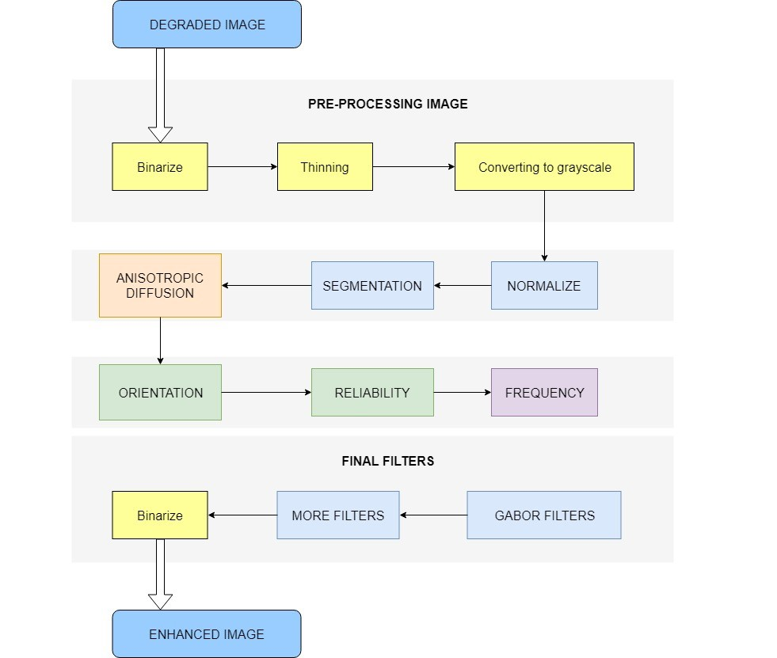
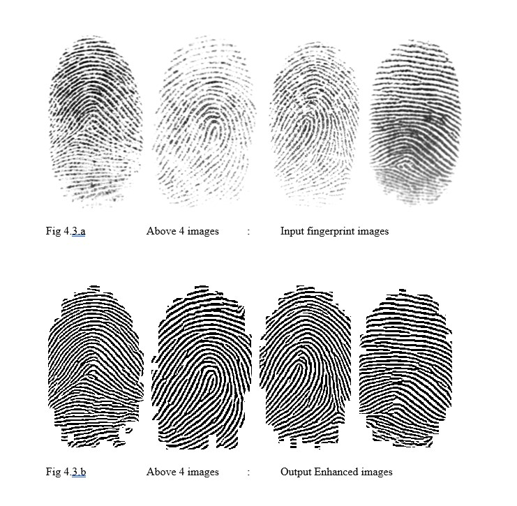

Building an Algorithm to enhance the fingerprint from a dull or distorted fingerprint image.

## Description

The goal of this algorithm is to recover the ridge features for all the recoverable region. Even for the unrecoverable region, algorithm will try to make the most of every minute details of the image and connect the dots. But there can be possibility that it might be slightly different from the original there a reliability factor is introduced in this project which will help us decide to what extend we need to go on. At last the acceptable reliability factor will be applied to get the most accurate and enhanced image from the distorted fingerprint image.

## Algorithm:

Algorithm  

### A.	PRE-PROCESSING IMAGE

It is the first process which takes the degraded fingerprint image and starts the algorithm. This process merely makes the image ready and doesn’t actually enhance the image, therefore it’s a pre-processing method. I’ve summed up the pre-processing into 3 steps:
1.	Binarize
2.	Thinning
3.	Converting to grayscale

### B.	NORMALIZE AND SEGMENTATION

1.  NORMALIZATION 
It is done to reduce the variation of image along the ridge, still keeping the clarity of the input image.

2.  SEGMENTATION
It’s basically done to identify all the patterns which looks like ridge and then again, the image is renormalized to have zero mean and unit standard deviation.

### C.	DIFFUSION
For better smoothing of image, I’ve used Anisotropic diffusion which keeps the edges sharp while smoothing the entire image.

### D.	ORIENTATION, RELIABILITY AND FREQUENCY
Calculations which will help us for further calculations of reliability and restoration of frequency.

### E.	GABOR FILTERS AND OTHER ENHANCING FILTERS
Gabor filter is used for edge detection. It has frequency and orientation selective possessions which permits it to be adjusted to give the best response to ridges which was discussed earlier.

## Running the tests

This project will be needing Matlab to perform all the actions

## Result

