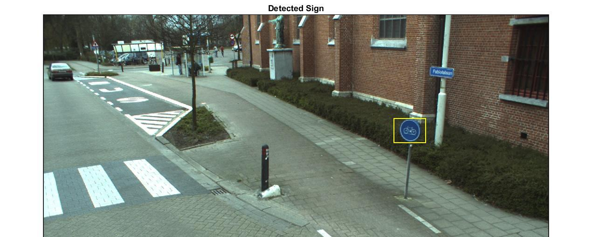

# Traffic_sign_recognition
Recognize traffic sign using Histogram of Oriented Gradients (HOG) and Colorspace based features. Support Vector Machines (SVM) is used for classifying images from KITTI Vision Benchmark Suite. Details regarding implementation are included in Report file.

# Detection Result

# Result Video
[Video demo](https://www.dropbox.com/s/619bsmlodktlxpl/out_tsr_v2.mkv?dl=0)

# Contributors
[Sarveshwaran Jayaraman](https://www.linkedin.com/in/sarveshjayaraman/)   Gowtham Raj and Siddarth Bansal
